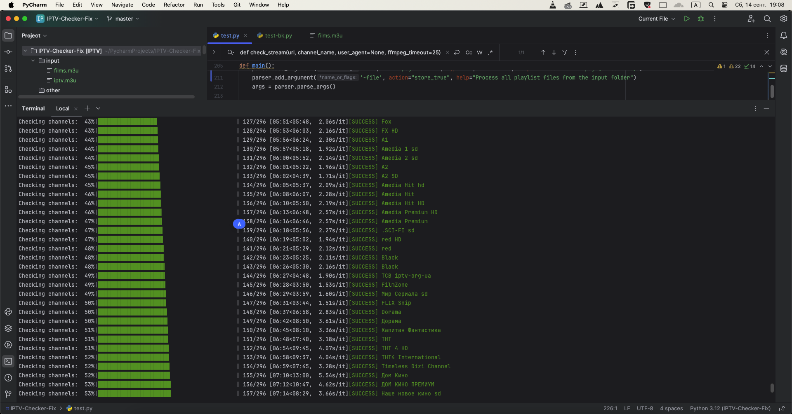

---



---

Here is a detailed and clear README.md for your GitHub repository, including usage instructions:

---

# IPTV Playlist Checker

This Python script allows you to check the availability and functionality of IPTV streams from an `.m3u` or `.m3u8` playlist. It verifies the streams by sending a `HEAD` request and then checks the stream playback using `ffmpeg`. The script supports multithreading, error logging, and provides detailed statistics after processing.

## Features

- **Stream Checking**: Verifies if IPTV streams are available and playable using `ffmpeg`.
- **Error Handling**: Logs failed streams and records them for further review.
- **Multithreading**: Supports concurrent stream checking to speed up the process.
- **Playlist Caching**: Avoids re-checking the same stream multiple times by caching results.
- **Extensive Logging**: Detailed logs for all processed channels.
- **Supports Multiple Playlists**: Can process individual playlists or all files in a directory.
- **Dry Run Mode**: Simulates stream checking without actually querying the streams.

## Requirements

The script requires the following dependencies:

- **Python 3.x**
- **ffmpeg** (must be installed and available in your system's `PATH`)
- **Python packages**:
  - `requests`
  - `tqdm`
  - `colorama`

Install the required Python packages via `pip`:

```bash
pip install requests tqdm colorama
```

## Installation

1. Clone the repository:

   ```bash
   git clone https://github.com/yourusername/iptv-checker.git
   cd iptv-checker
   ```

2. Ensure `ffmpeg` is installed and available in your `PATH`. Check if `ffmpeg` is installed:

   ```bash
   ffmpeg -version
   ```

3. Install required Python dependencies:

   ```bash
   pip install -r requirements.txt
   ```

## Usage

### Basic Usage

To check a single playlist file or URL:

```bash
python iptv_checker.py -p <playlist_url_or_file> -s <save_path>
```

### Example:

```bash
python iptv_checker.py -p http://example.com/playlist.m3u -s output/checked_playlist.m3u
```

### Multithreading

To use multiple threads for faster processing:

```bash
python iptv_checker.py -p <playlist_url_or_file> -s <save_path> -t 4
```

This command will check the playlist using 4 threads.

### Directory Mode

To process all `.m3u` and `.m3u8` files in the `input/` directory and save the results to the `output/` directory:

```bash
python iptv_checker.py -file
```

The script will automatically process all playlist files in the directory.

### Dry Run Mode

To simulate checking streams without actually making network requests:

```bash
python iptv_checker.py --dry-run
```

This will print simulated success messages without contacting any streams.

### Full Command Options

| Argument             | Description                                           |
| -------------------- | ----------------------------------------------------- |
| `-p, --playlist`      | URL or path to the playlist file                      |
| `-s, --save`          | Path to save the checked playlist                     |
| `-t, --threads`       | Number of threads for checking streams (default: 1)   |
| `-ft, --ffmpeg-timeout` | Timeout for ffmpeg (in seconds, default: 15)       |
| `-file`               | Process all `.m3u`/`.m3u8` files from the input folder|
| `--dry-run`           | Enable dry run mode (no actual stream checking)       |

## Example:

To check a playlist with 4 threads and save the result:

```bash
python iptv_checker.py -p playlist.m3u -s checked_playlist.m3u -t 4
```

## Output

The script will save the updated playlist in the specified file and display a summary of the results:

- **Working channels**: Successfully playable channels
- **Failed channels**: Channels that could not be accessed or played
- **Timeouts**: Channels that took too long to respond
- **Skipped channels**: Channels that were skipped during the check

Example output:

```
=== Statistics ===
Working channels added: 20 (66.67%)
Failed channels removed: 8 (26.67%)
Timeouts: 2 (6.66%)
Playlist saved to output/checked_playlist.m3u
```

## Logging

The script generates a log file `iptv_check.log` that contains detailed information about each channel's check result, errors encountered, and summary statistics.

## License

This project is licensed under the MIT License. See the `LICENSE` file for more details.

---

Feel free to customize the repository link and details as necessary!
