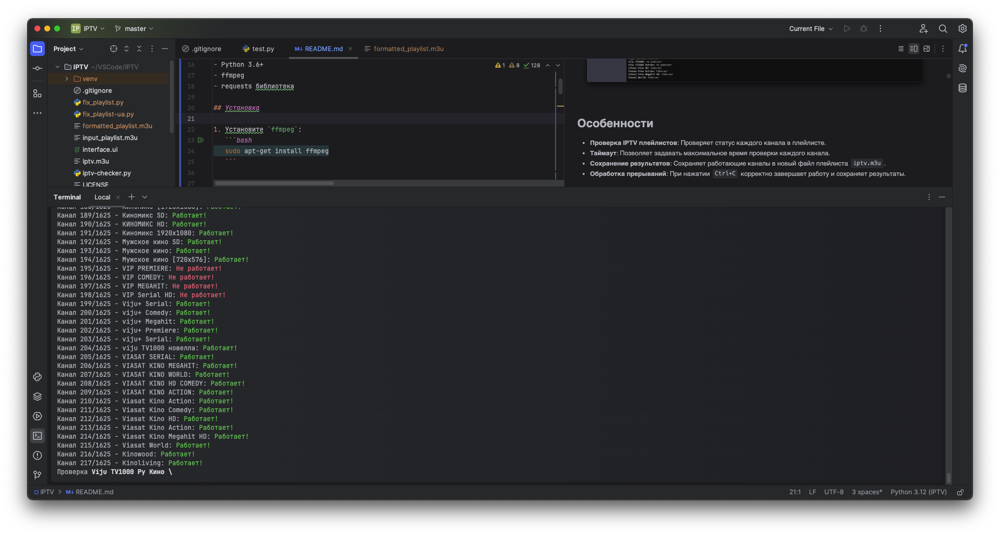

# IPTV Checker


Этот скрипт представляет собой утилиту для проверки работоспособности каналов в IPTV плейлистах. Он осуществляет проверку каждого канала на доступность с использованием различных методов, таких как проверка с помощью FFmpeg, FFprobe и HTTP-запросов. Скрипт анализирует структуру плейлиста, обеспечивая его корректность, а затем создает новый плейлист, содержащий только рабочие каналы.





## Особенности

- Проверка каналов на доступность с использованием FFmpeg, FFprobe и HTTP-запросов.
- Автоматическая коррекция некорректной структуры плейлиста.
- Поддержка работы с локальными файлами и URL-адресами плейлистов.
- Контроль времени ожидания для каждой проверки канала.

## Использование

1. Убедитесь, что у вас установлены `ffmpeg` и `ffprobe`.
2. Запустите скрипт с указанием пути или URL-адреса к плейлисту IPTV.

```bash
python iptv_checker.py -p <путь_к_плейлисту> --timeout <таймаут>
```

- `-p, --playlist`: Путь или URL-адрес к плейлисту IPTV.
- `--timeout`: Таймаут проверки каждого канала (в секундах).
- `-o, --output`: Имя файла для сохранения рабочих каналов (по умолчанию `iptv.m3u`).

## Пример

```bash
python iptv_checker.py -p playlist.m3u --timeout 15 -o working_channels.m3u
```

## Лицензия

Этот проект лицензируется под [лицензией MIT](LICENSE).

---

Пожалуйста, не забудьте заменить `yourusername/yourrepositoryname` на свой актуальный GitHub username и название репозитория.