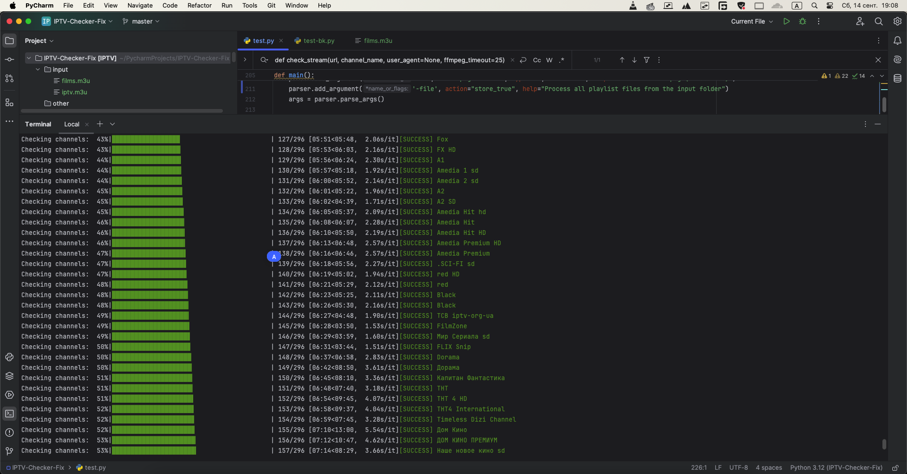

---



---

Вот пример полного описания и инструкции по использованию для GitHub-репозитория.

---

# IPTV Playlist Checker

Этот скрипт предназначен для проверки работоспособности IPTV плейлистов с использованием `ffmpeg`. Он поддерживает многопоточную проверку, обработку ошибок, ведение логов и возможность сохранения промежуточных результатов.

## Особенности

- Проверка IPTV плейлистов (локальных файлов или URL).
- Многопоточная проверка с возможностью настройки числа потоков.
- Поддержка таймаута для проверки потоков.
- Автоматическое сохранение рабочего плейлиста.
- Логи в формате `.log` для последующего анализа.
- Возможность пропуска нерабочих потоков и сохранения информации о них в отдельный файл.
- Возможность работы с плейлистами, хранящимися в директории.
- Поддержка режима "сухого запуска" для тестирования без реальных проверок.

## Зависимости

Перед использованием убедитесь, что установлены следующие зависимости:

1. Python 3.6+
2. Модули:
   - `requests`
   - `tqdm`
   - `colorama`
   - `concurrent.futures` (встроен в Python 3.2+)
3. `ffmpeg` (должен быть доступен в системе через переменную PATH).

### Установка зависимостей

Установите необходимые Python модули с помощью `pip`:

```bash
pip install requests tqdm colorama
```

Убедитесь, что `ffmpeg` установлен на вашем компьютере:

- **Для Ubuntu/Debian:**

  ```bash
  sudo apt install ffmpeg
  ```

- **Для MacOS (через Homebrew):**

  ```bash
  brew install ffmpeg
  ```

- **Для Windows:**

  Скачайте и установите [FFmpeg](https://ffmpeg.org/download.html), добавьте его в PATH.

## Использование

### Основные параметры

- `-p, --playlist` — путь к плейлисту (локальный файл или URL).
- `-s, --save` — путь для сохранения проверенного плейлиста (по умолчанию сохраняется в директорию `output`).
- `-t, --threads` — количество потоков для проверки (по умолчанию: 1).
- `-ft, --ffmpeg-timeout` — таймаут для `ffmpeg` (по умолчанию: 15 секунд).
- `-file` — обрабатывает все файлы плейлистов в директории `input`.
- `--dry-run` — режим сухого запуска (не выполняет проверку потоков).

### Примеры использования

1. **Проверка плейлиста из URL с 4 потоками:**

   ```bash
   python iptv-check.py -p http://example.com/playlist.m3u -t 4
   ```

2. **Проверка локального файла плейлиста с сохранением результата:**

   ```bash
   python iptv-check.py -p /path/to/playlist.m3u -s /path/to/save/checked_playlist.m3u
   ```

3. **Проверка всех плейлистов в директории `input`:**

   ```bash
   python iptv-check.py -file -t 3
   ```

4. **Запуск в режиме "сухого теста":**

   ```bash
   python iptv-check.py --dry-run
   ```

### Логи и статистика

После завершения проверки будет выведена статистика и сохранен лог с подробной информацией о проверке в файл `iptv_check.log`.

Пример вывода статистики:

```
=== Statistics ===
Working channels added: 50 (83.33%)
Failed channels removed: 10 (16.67%)
Timeouts: 5 (8.33%)
Skipped channels: 2 (3.33%)
```

## Обработка ошибок

- В случае проблем с доступом к потоку или ошибки `ffmpeg`, будет записано сообщение в лог с соответствующим описанием ошибки.
- Таймауты обработки потоков также будут записаны и отображены в статистике.

---

Если у вас возникли проблемы с установкой `ffmpeg` или другими компонентами, обратитесь к [официальной документации FFmpeg](https://ffmpeg.org/documentation.html) или откройте [issue на GitHub](https://github.com/).

---
