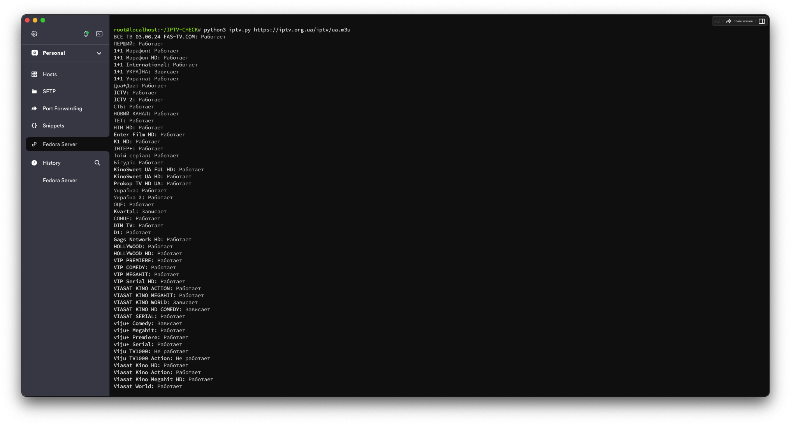

# IPTV Checker

IPTV Checker — это инструмент для проверки IPTV плейлистов, который позволяет проверять статус потоков и сохранять работающие каналы в новый файл плейлиста. Он использует `ffmpeg` для проверки доступности потоков и поддерживает как локальные файлы, так и URL.



## Особенности

- **Проверка IPTV плейлистов**: Проверяет статус каждого канала в плейлисте.
- **Таймаут**: Позволяет задавать максимальное время проверки каждого канала.
- **Сохранение результатов**: Сохраняет работающие каналы в новый файл плейлиста `iptv.m3u`.
- **Обработка прерываний**: При нажатии `Ctrl+C` корректно завершает работу и сохраняет результаты.

## Требования

- Python 3.6+
- ffmpeg
- requests библиотека

## Установка

1. Установите `ffmpeg`:
   ```bash
   sudo apt-get install ffmpeg
   ```

2. Установите библиотеку `requests`:
   ```bash
   pip install requests
   ```

3. Установите библиотеку `colorama`:
   ```bash
   pip install colorama
   ```

## Использование

Запустите скрипт с указанием пути к плейлисту или URL и опционально задайте таймаут:

### Пример использования с локальным файлом

```bash
python ip-tv-checker.py iptv-list.m3u --timeout 15
```

### Пример использования с URL

```bash
python ip-tv-checker.py https://iptv.com.ua/iptv-list.m3u --timeout 10
```

## Пример вывода

```
ВСЕ ТВ 03.06.24 FAS-TV.COM: Работает
ПЕРШИЙ: Работает
1+1 Марафон: Работает
1+1 International: Работает
...
```

## Обработчик прерываний

Если вы нажмете `Ctrl+C` во время выполнения скрипта, он сохранит уже проверенные каналы и корректно завершит работу.

## Код

```python
import argparse
import subprocess
import signal
import sys
import multiprocessing
import requests
from colorama import init, Fore, Style

# Initialize colorama
init(autoreset=True)

checked_channels = []
working_channels = []

def signal_handler(sig, frame):
    print("\nЗавершение работы...")
    save_results()
    sys.exit(0)

signal.signal(signal.SIGINT, signal_handler)

def check_url(url, timeout=15):
    try:
        response = requests.head(url, timeout=timeout)
        response.raise_for_status()
        return True
    except requests.RequestException as e:
        print(f"Request error: {e}")
        return False

def check_ffmpeg(url, timeout=15):
    try:
        result = subprocess.run(
            ["ffmpeg", "-i", url, "-t", str(timeout), "-v", "error", "-f", "null", "-"],
            stdout=subprocess.PIPE, stderr=subprocess.PIPE
        )
        stderr_output = result.stderr.decode()
        if result.returncode == 0:
            return True
        if "Server returned 404 Not Found" in stderr_output or "Invalid data found" in stderr_output:
            print(f"FFmpeg error: {stderr_output}")
            return False
        return True
    except subprocess.TimeoutExpired:
        return "timeout"
    except subprocess.SubprocessError as e:
        print(f"FFmpeg SubprocessError: {e}")
        return False

def check_ffprobe(url, timeout=15):
    try:
        result = subprocess.run(
            ["ffprobe", url],
            stdout=subprocess.PIPE, stderr=subprocess.PIPE, timeout=timeout
        )
        stderr_output = result.stderr.decode()
        if "Input/output error" in stderr_output:
            return False
        return result.returncode == 0
    except subprocess.TimeoutExpired:
        return "timeout"
    except subprocess.SubprocessError as e:
        print(f"FFprobe SubprocessError: {e}")
        return False

def check_channel(url, timeout=15):
    if not check_url(url, timeout):
        return False
    if check_ffprobe(url, timeout):
        return True
    return check_ffmpeg(url, timeout)

def check_channel_with_timeout(url, timeout=15):
    def target(queue):
        result = check_channel(url, timeout)
        queue.put(result)

    queue = multiprocessing.Queue()
    process = multiprocessing.Process(target=target, args=(queue,))
    process.start()
    process.join(timeout + 10)

    if process.is_alive():
        process.terminate()
        process.join()
        return "Зависает"

    try:
        result = queue.get_nowait()
    except:
        result = "Зависает"

    return result

def check_playlist(file_path, timeout=15):
    global checked_channels, working_channels

    if file_path.startswith('http://') or file_path.startswith('https://'):
        try:
            response = requests.get(file_path)
            response.raise_for_status()
            lines = response.text.splitlines()
        except requests.RequestException as e:
            print(f"Failed to download playlist: {e}")
            return []
    else:
        with open(file_path, 'r', encoding='utf-8') as file:
            lines = file.readlines()

    for i in range(len(lines)):
        if lines[i].startswith('#EXTINF:'):
            channel_name = lines[i].strip().split(',')[-1]
            channel_url = lines[i + 1].strip()
            print(Fore.BLUE + f"Проверка {channel_name}...")
            result = check_channel_with_timeout(channel_url, timeout)
            if result == True:
                status = Fore.GREEN + "Работает!"
                working_channels.append(lines[i])
                working_channels.append(lines[i + 1])
            elif result == "timeout":
                status = Fore.RED + "Время проверки истекло!"
            elif result == "Зависает":
                status = Fore.YELLOW + "Зависает!"
            else:
                status = Fore.RED + "Не работает!"
            print(f"{channel_name}: {status}")
            checked_channels.append(f"{channel_name}: {status}")

def save_results():
    global working_channels
    with open('iptv.m3u', 'w', encoding='utf-8') as file:
        file.write('#EXTM3U\n')
        for i in range(0, len(working_channels), 2):
            file.write(working_channels[i] + '\n')
            file.write(working_channels[i + 1] + '\n')

def main():
    parser = argparse.ArgumentParser(description='IPTV Checker\n Проверка IPTV')
    parser.add_argument('playlist', help='Path or URL to the IPTV playlist\n Путь или URL-адрес к списку воспроизведения IPTV')
    parser.add_argument('--timeout', type=int, default=15, help='Timeout for checking each channel (in seconds)\n Таймаут проверки каждого канала (в секундах)')
    args = parser.parse_args()

    check_playlist(args.playlist, args.timeout)
    save_results()

if __name__ == "__main__":
    main()

```

## Лицензия

Этот проект лицензирован под MIT License - смотрите [LICENSE](LICENSE) файл для деталей.

---

### Ссылки и ресурсы

- [FFmpeg](https://ffmpeg.org/)
- [Requests](https://docs.python-requests.org/en/latest/)

